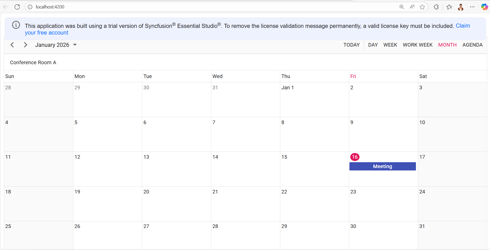

# Angular Firebase Scheduler

This project is an Angular application that integrates the Syncfusion Scheduler component with Firebase Firestore to enable real-time data storage and live scheduling updates.

## Prerequisites

Ensure the following are installed before starting:

- **Node.js** v14.x or later  
- **npm** v6.x or later (included with Node.js)  
- **Angular CLI** v15.x or later  

## Application Setup

### Clone the Repository
```bash
git clone https://github.com/SyncfusionExamples/ej2-angular-scheduler-with-firebase.git

cd ej2-angular-scheduler-with-firebase
```
### Install Dependencies
```bash
npm install
```
## Firebase Creation & Integration

### Create Firebase Project
- Navigate to the Firebase Console: [Link](https://console.firebase.google.com/)
- Click Add project and enter a project name.
- Proceed through the setup steps and create the project.
- Once the project is created, click Add app → Web (</>).
- Register the web app and copy the generated Firebase configuration.

### Configure Firebase in Angular
Add the Firebase configuration directly into the Angular bootstrap file.
**src/main.ts**
```

const firebaseConfig = {
  apiKey: "YOUR_API_KEY",
  authDomain: "YOUR_AUTH_DOMAIN",
  projectId: "YOUR_PROJECT_ID",
  storageBucket: "YOUR_STORAGE_BUCKET",
  messagingSenderId: "YOUR_MESSAGING_SENDER_ID",
  appId: "YOUR_APP_ID",
  measurementId: "YOUR_MEASUREMENT_ID"
};
```
This configuration is used to initialize Firebase services when the application starts.

## Firestore Creation & Integration

### Enable Firestore Database
- In the Firebase Console, open Build → Firestore Database.
- Click Create database.
- Select Start in test mode (recommended for development).
- Choose a Firestore region and complete setup.

### Create Required Firestore Collections
Create the following collections in Firestore:

- #### Data
  Stores Scheduler event records.
  
  Suggested fields:
  - Subject (string)
  - StartTime (timestamp)
  - EndTime (timestamp)
  - IsAllDay (boolean)
  - ConferenceId (string or number)
  - DocumentId (string – Firestore document ID)

- #### ResourceData
  Stores Scheduler resource information.
  
  Suggested fields:
  - Id (string or number)
  - Text (string)
  - Color (string)
### Firestore Integration in the Application
- Event and resource data are read in real time using collectionData()
- Firestore Timestamp values are converted to JavaScript Date objects before binding to the Scheduler
- Scheduler CRUD operations are handled through the actionBegin event:
  - Create → setDoc()
  - Update → updateDoc()
  - Delete → deleteDoc()
- Each Scheduler event maintains a DocumentId to map it to the corresponding Firestore document

## Development Notes
- Firestore test mode should only be used during development
- Update Firestore security rules before deploying to production
- Ensure collection names (Data, ResourceData) match exactly in code and database

## Running the Application

Run the following command to start the app:
```bash
ng serve
```

Open your browser at: `http://localhost:4200`

## Output Preview




## Troubleshooting

- **Application does not start**
  - Ensure Node.js and Angular CLI are installed
  - Check versions using:
    ```bash
    node -v
    ng version
    ```

- **`ng serve` command not found**
  - Install Angular CLI globally:
    ```bash
    npm install -g @angular/cli
    ```

- **Firebase data not loading**
  - Verify Firebase configuration in `src/main.ts`
  - Ensure Firestore is enabled in the Firebase Console
  - Confirm `Data` and `ResourceData` collections exist

- **Firestore permission denied errors**
  - Make sure Firestore is set to **test mode** during development
  - Check Firestore security rules

- **Port 4200 already in use**
  - Run the application on a different port:
    ```bash
    ng serve --port 4300
    ```

- **Dependency installation issues**
  - Delete `node_modules` and reinstall dependencies:
    ```bash
    npm install
    ```